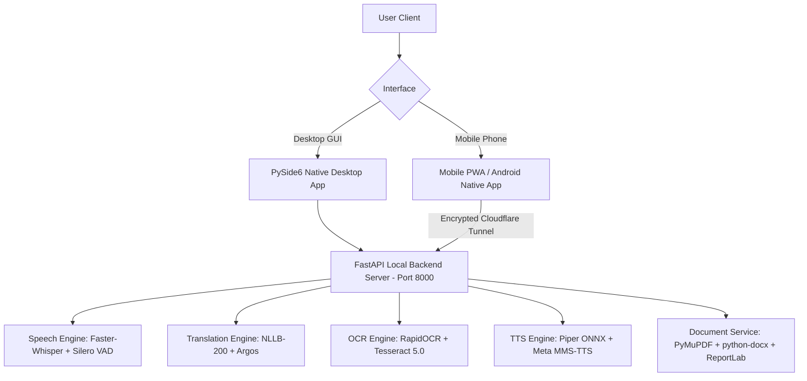

# 🌐 LinguaFusion — Offline-First Multilingual AI Translation & Speech Suite

[](https://linguafusion.fyi)
[]()
[]()

**LinguaFusion** is a powerful, production-grade, local-first AI translation and speech processing application. It provides real-time speech transcription, neural translation across 200+ languages, document reading, optical character recognition (OCR), multi-format batch document translation, neural speech synthesis (TTS), and instant cross-device mobile pairing over encrypted tunnels.

---

## 🌟 Key Features & Capabilities

### 1. 🎤 Real-Time Speech Recognition & Translation (STT)
- **Engine**: Accelerated `faster-whisper` (Medium model) with CUDA GPU INT8/FP16 quantization.
- **Multilingual Support**: Real-time microphone listening and audio file transcription across 99+ languages.
- **Specialized Dialect Models**: Dedicated Meta MMS-ASR model for Odia (`ori`) transcription.
- **VAD & Noise Suppression**: Integrated Silero Voice Activity Detection (VAD) for background noise filtering.

### 2. 🔠 Multilingual Neural Machine Translation (NMT)
- **Primary Engine**: Meta NLLB-200 (distilled 600M parameters via `ctranslate2` INT8 GPU compute) supporting 200+ languages and regional dialects.
- **Fallback Engine**: Argos Translate for ultra-fast local offline translation.
- **Translation in Scan/OCR**: Direct translation of OCR-extracted text into target languages.
- **Context-Aware Entity Protection**: Preserves proper nouns, brand names, code blocks, and formatted structures during translation.

### 3. 🖼️ Advanced Optical Character Recognition (OCR)
- **Dual Engine System**: RapidOCR for photo/screenshot text extraction + Tesseract OCR 5.0 for multi-page PDF documents.
- **Language Support**: English, German, Spanish, Hindi, Arabic, Odia (`ori`), and multi-script combinations.
- **Batch OCR & Translation**: Process entire directories of images or scanned PDFs into `.docx`, `.pdf`, `.txt`, `.srt`, or `.vtt`.

### 4. 📁 Batch Document Translation & Export
- **Supported Formats**: Direct import and processing of `.pdf`, `.docx`, `.txt`, `.srt`, and `.vtt` files.
- **Unified Export Dropdown**: Choose output format (`Same as source`, `.docx`, `.pdf`, `.txt`) across all tabs.
- **Batch Processing**: Translate dozens of documents simultaneously with structure and formatting preservation, exported as a single `.zip` archive.

### 5. 🔊 Neural Text-to-Speech (TTS) & Audio Reader
- **Piper ONNX Neural Voices**: Ultra-realistic local TTS synthesis for English, German, Spanish, and Hindi.
- **Meta MMS-TTS**: High-fidelity neural voice synthesis for Arabic (`ar`) and Odia (`or`).
- **Synchronized Reader**: Dual-pane reader interface with playback, sentence highlighting, speed control (0.5x – 2.0x), and pitch adjustment.

### 6. 🌐 Automatic Remote Access & Cloudflare Tunneling
- **Zero Router Setup**: Built-in Cloudflare Tunnel (`cloudflared`) creates encrypted outbound HTTPS tunnels automatically on boot.
- **Global Mobile Access**: Access your PC backend from your phone anywhere in the world on 4G, 5G, or hotel Wi-Fi without opening router ports.
- **QR Code Device Pairing**: Generate 1-click QR codes in the desktop app for secure, persistent mobile device authorization stored in SQLite (`mobile_access.db`).

### 7. 📲 Standalone Mobile App (PWA & Android)
- **Progressive Web App (PWA)**: Standalone web client with offline caching (`linguafusion-mobile-v14`), native microphone capture, camera scanning, and responsive mobile UI.
- **Native Android Project**: Bundled Android WebView source in `mobile_android/` for compiling standalone `.apk` packages.

---

## 🏗️ Architecture & Component Overview



---

## 🛠️ Complete Summary of Improvements & Technical Polish

| Category | Component / Feature | Details & Impact |
| :--- | :--- | :--- |
| **Document Processing** | Batch Translation | Moved Batch Translate to **Translate** tab with Target Language & Export Format selector (`same`, `docx`, `pdf`, `txt`). |
| **OCR & Scan** | Batch OCR & Translate | Added 📁 Batch OCR button in **Scan/OCR** tab supporting image/PDF directory extraction directly to chosen target formats. |
| **Export System** | Unified Export Dropdowns | Replaced rows of individual export buttons with a clean **Export Format Dropdown** (`DOCX`, `PDF`, `TXT`, `SRT`, `VTT`) + single **"⤓ Export"** button across Desktop & Mobile UI. |
| **Mobile PWA** | Mobile Navigation | Fixed mobile tab switching, touch event handlers, Service Worker cache tag (`v14`), and versioned asset parameters (`app.js?v=1.0.14`). |
| **Remote Access** | Auto Cloudflare Tunneling | Added `@app.on_event("startup")` handler to launch `cloudflared` automatically on backend start, populating QR codes out of the box for global 4G/5G mobile access. |
| **Android Client** | Native Android Project | Generated `mobile_android/` project structure with `MainActivity.java`, camera/mic permissions, and `scripts/build_android_project.py` for APK compilation. |
| **Packaging** | Standalone Setup Installer | Built 1-click Windows installer `dist_installer/LinguaFusion-Setup.exe` (**3.16 GB**) using Inno Setup 6.7.3, featuring silent startup (`LinguaFusionBackend.vbs`). |

---

## 📂 Directory Structure

```
W:\OfflineSpeechTranslator_dev_v1.0\
├── backend/
│   ├── api/                    # FastAPI routes and endpoints
│   ├── config/                 # Environment and runtime paths
│   ├── mobile_web/             # Mobile PWA web application (HTML/CSS/JS/SW)
│   ├── services/               # Core AI services (Whisper, NLLB, OCR, TTS, Reader, Tunnel)
│   └── server.py               # Main FastAPI server entry point
├── desktop/
│   ├── main.py                 # PySide6 Native Desktop GUI application
│   └── assets/                 # High-resolution icons and visuals
├── dist_installer/
│   └── LinguaFusion-Setup.exe  # 1-Click Offline Windows Setup Installer (3.16 GB)
├── mobile_android/             # Standalone Native Android WebView project
├── models/                     # Offline AI models (NLLB-200, Piper, MMS-TTS, Tessdata)
├── scripts/                    # Utility, launcher, and build scripts
├── LinguaFusion.iss            # Inno Setup 6.7.3 compiler script
├── pyinstaller_desktop.spec    # PyInstaller packaging configuration
└── README.md                   # Project documentation
```

---

## 🚀 Quick Start Guide

### 1. 📦 Installation via Standalone Setup Wizard (Recommended for Users)
1. Run `dist_installer/LinguaFusion-Setup.exe`.
2. Follow the wizard prompts to install LinguaFusion.
3. Launch **LinguaFusion** from your Desktop shortcut or Start Menu.
4. The background server starts automatically (`LinguaFusionBackend.vbs`).

### 2. 💻 Running from Source (Developer Mode)

#### Prerequisites
- Windows 10/11 64-bit
- NVIDIA GPU with CUDA 12.0+ support (Recommended 6GB+ VRAM)
- Python 3.10

#### Commands
```bash
# 1. Activate Virtual Environment
.\.venv\Scripts\activate

# 2. Start Backend Server
python backend/server.py

# 3. Launch PySide6 Desktop Interface (in a separate terminal)
python desktop/main.py
```

### 3. 📲 Pairing Your Mobile Phone
1. Open LinguaFusion Desktop app $\rightarrow$ navigate to the **Mobile App / Remote Access** tab.
2. Click **"Generate Join QR Code"**.
3. Scan the QR code with your iPhone or Android phone camera.
4. Tap **"Add to Home Screen"** (Safari on iOS) or **"Install App"** (Chrome on Android) for 1-click standalone mobile access anytime, anywhere in the world!

---

## 📄 License & Credits

- **LinguaFusion**: Developed by the LinguaFusion Core Engineering Team.
- **Underlying AI Frameworks**: PyTorch, Faster-Whisper, CTranslate2, NLLB-200, RapidOCR, Tesseract, Piper TTS, Meta MMS.

```powershell
python -m uvicorn backend.server:app --reload --host 127.0.0.1 --port 8000
```

In a second terminal, start the desktop app:

```powershell
python .\desktop\main.py
```

Health check:

```text
http://localhost:8000/health
```

The public health response is deliberately minimal. Authenticated runtime and
model details are available from `http://localhost:8000/diagnostics`. For LAN
phone pairing, use `scripts\start_mobile_backend.ps1`, which binds only to the
selected private network interface.

See `README_RUN_WINDOWS.md` for a more detailed Windows run guide.

## Privacy and local files

LinguaFusion is intended to run locally. Local models, generated audio, user correction data, runtime databases, logs, and temporary files should remain outside the public repository. Keep them excluded through `.gitignore`.

## Status

Current public version: `1.0.0-beta.5`

This is an active development project. Some workflows, especially OCR table reconstruction, document layout preservation, and speech alignment, are best-effort and may vary by input quality and installed local models.

## License

This project is licensed under the MIT License. See the `LICENSE` file for details.

